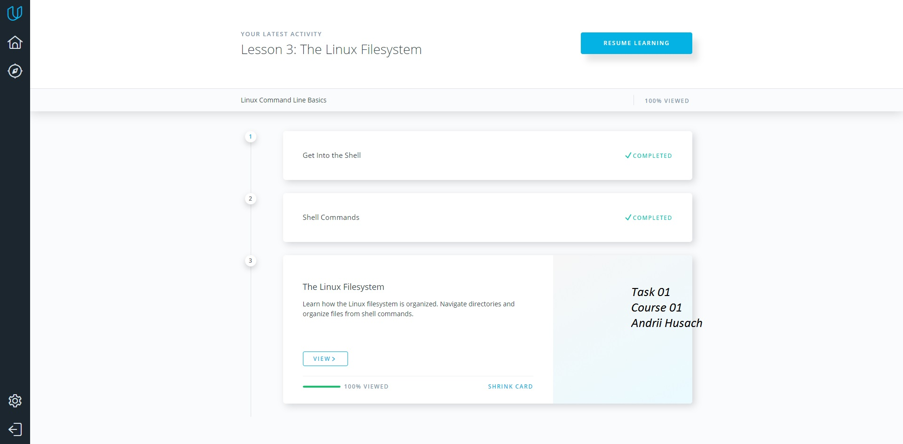

Task 00
          -  This information was interesting, but I already knew a lot.

Task 01 - Linux Command Line Basics

Task 01 - Configuring Linux Web Servers

Task 01 - Networking for Web Developers

Task 02 - What is Version Control

Task 02 - What is Version Control

Task 02 - GitHub & Collaboration

Task 03 - HTML5 and CSS Fundamentals

Task 04 - Responsive Web Design Fundamentals

Task 05 - Intro to JS

